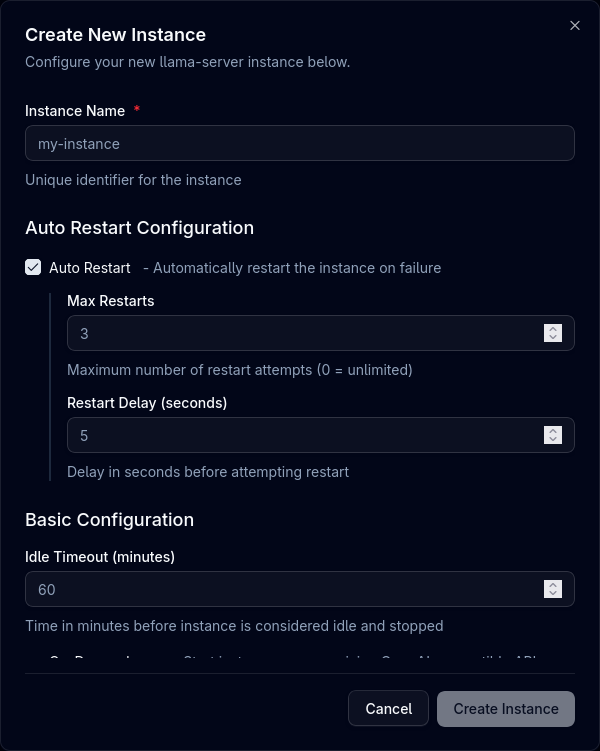

# Managing Instances

Learn how to effectively manage your Llama.cpp instances with Llamactl through both the Web UI and API.

## Overview

Llamactl provides two ways to manage instances:

- **Web UI**: Accessible at `http://localhost:8080` with an intuitive dashboard
- **REST API**: Programmatic access for automation and integration


### Authentication

If authentication is enabled:
1. Navigate to the web UI
2. Enter your credentials
3. Bearer token is stored for the session

### Theme Support

- Switch between light and dark themes
- Setting is remembered across sessions

## Instance Cards

Each instance is displayed as a card showing:

- **Instance name**
- **Health status badge** (unknown, ready, error, failed)
- **Action buttons** (start, stop, edit, logs, delete)

## Create Instance

### Via Web UI



1. Click the **"Create Instance"** button on the dashboard
2. Enter a unique **Name** for your instance (only required field)
3. Configure model source (choose one):
    - **Model Path**: Full path to your downloaded GGUF model file
    - **HuggingFace Repo**: Repository name (e.g., `unsloth/gemma-3-27b-it-GGUF`)
    - **HuggingFace File**: Specific file within the repo (optional, uses default if not specified)
4. Configure optional instance management settings:
    - **Auto Restart**: Automatically restart instance on failure
    - **Max Restarts**: Maximum number of restart attempts
    - **Restart Delay**: Delay in seconds between restart attempts
    - **On Demand Start**: Start instance when receiving a request to the OpenAI compatible endpoint
    - **Idle Timeout**: Minutes before stopping idle instance (set to 0 to disable)
5. Configure optional llama-server backend options:
    - **Threads**: Number of CPU threads to use
    - **Context Size**: Context window size (ctx_size)
    - **GPU Layers**: Number of layers to offload to GPU
    - **Port**: Network port (auto-assigned by llamactl if not specified)
    - **Additional Parameters**: Any other llama-server command line options (see [llama-server documentation](https://github.com/ggerganov/llama.cpp/blob/master/examples/server/README.md))
6. Click **"Create"** to save the instance  

### Via API

```bash
# Create instance with local model file
curl -X POST http://localhost:8080/api/instances/my-instance \
  -H "Content-Type: application/json" \
  -d '{
    "backend_type": "llama_cpp",
    "backend_options": {
      "model": "/path/to/model.gguf",
      "threads": 8,
      "ctx_size": 4096
    }
  }'

# Create instance with HuggingFace model
curl -X POST http://localhost:8080/api/instances/gemma-3-27b \
  -H "Content-Type: application/json" \
  -d '{
    "backend_type": "llama_cpp",
    "backend_options": {
      "hf_repo": "unsloth/gemma-3-27b-it-GGUF",
      "hf_file": "gemma-3-27b-it-GGUF.gguf",
      "gpu_layers": 32
    },
    "auto_restart": true,
    "max_restarts": 3
  }'
```

## Start Instance

### Via Web UI
1. Click the **"Start"** button on an instance card
2. Watch the status change to "Unknown"
3. Monitor progress in the logs
4. Instance status changes to "Ready" when ready

### Via API
```bash
curl -X POST http://localhost:8080/api/instances/{name}/start
```

## Stop Instance

### Via Web UI
1. Click the **"Stop"** button on an instance card
2. Instance gracefully shuts down

### Via API
```bash
curl -X POST http://localhost:8080/api/instances/{name}/stop
```

## Edit Instance

### Via Web UI
1. Click the **"Edit"** button on an instance card
2. Modify settings in the configuration dialog
3. Changes require instance restart to take effect
4. Click **"Update & Restart"** to apply changes

### Via API
Modify instance settings:

```bash
curl -X PUT http://localhost:8080/api/instances/{name} \
  -H "Content-Type: application/json" \
  -d '{
    "backend_options": {
      "threads": 8,
      "context_size": 4096
    }
  }'
```

!!! note
    Configuration changes require restarting the instance to take effect.


## View Logs

### Via Web UI

1. Click the **"Logs"** button on any instance card
2. Real-time log viewer opens

### Via API
Check instance status in real-time:

```bash
# Get instance details
curl http://localhost:8080/api/instances/{name}/logs
```

## Delete Instance

### Via Web UI
1. Click the **"Delete"** button on an instance card
2. Only stopped instances can be deleted
3. Confirm deletion in the dialog

### Via API
```bash
curl -X DELETE http://localhost:8080/api/instances/{name}
```

## Instance Proxy

Llamactl proxies all requests to the underlying llama-server instances.

```bash
# Get instance details
curl http://localhost:8080/api/instances/{name}/proxy/
```

Check llama-server [docs](https://github.com/ggml-org/llama.cpp/blob/master/tools/server/README.md) for more information.

### Instance Health

#### Via Web UI

1. The health status badge is displayed on each instance card

#### Via API

Check the health status of your instances:

```bash
curl http://localhost:8080/api/instances/{name}/proxy/health
```
